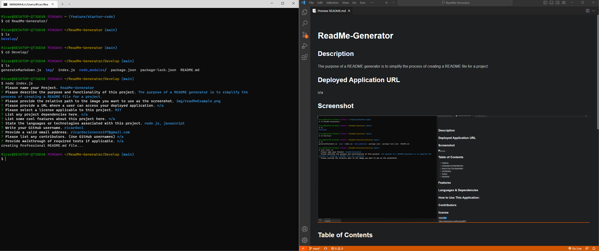

# ReadMe Generator
  
  ## Description
The purpose of this project is to simplify the process of creating a ReadMe file.
## Deployed Application URL
n/a
## Screenshot

## Table of Contents
* [Features](#features)
* [Languages & Dependencies](#languagesanddependencies)
* [How to Use This Application](#HowtoUseThisApplication)
* [Contributors](#contributors)
* [Testing](#testing)
* [Questions](#questions)
## Features
n/a
## Languages & Dependencies
n/a
## How to Use This Application:
.node.js .javascript
## Contributors
n/a
## license

   "https://opensource.org/licenses/MIT"
  
## Testing
n/a
## Questions
Please send your questions [here](mailto:ricardocisneros197@gmail.com?subject=[GitHub]%20Dev%20Connect) or visit [github/ricardoCi](https://github.com/ricardoCi).
